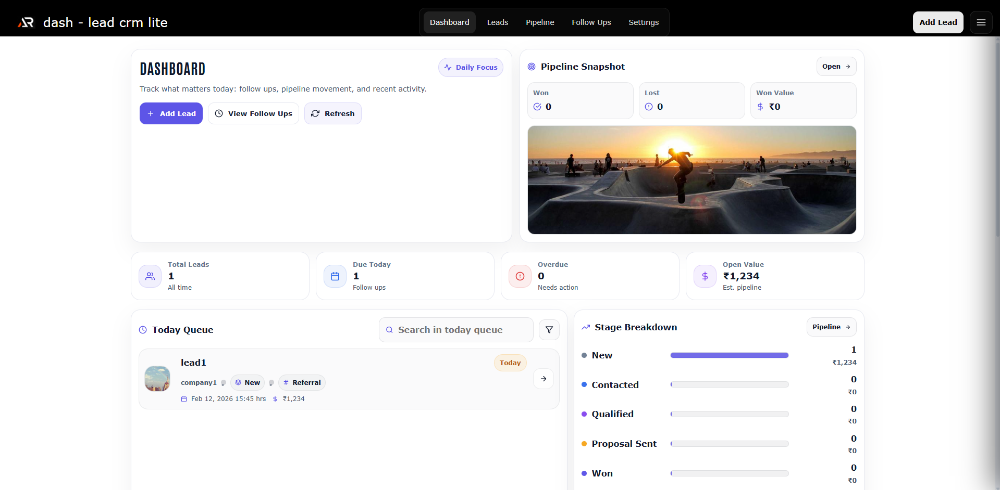

<div align="center">

# dash-lead-crm-lite

A frontend-only Lead CRM demo built in React to track leads, manage pipeline stages, and stay on top of follow-ups.

</div>

---



---

## What this is

dash-lead-crm-lite is a light-theme CRM UI that helps you:

- track leads and their status
- move leads through a sales pipeline
- plan and complete follow-ups
- view daily priorities on a dashboard

This is a frontend-only demo. Data is stored locally and can be exported/imported.

---

## Pages

- Dashboard - todays queue, overdue, upcoming, pipeline snapshot
- Leads - searchable list with filters, sort, bulk actions
- Lead Details - lead profile, timeline, notes, next follow-up
- Pipeline - stage board view for moving leads across stages
- Follow Ups - overdue and upcoming follow-ups in one place
- Settings - stages, sources, owners, export/import, reset demo data

---

## Key features

- Lead lifecycle stages: new, contacted, qualified, proposalSent, won, lost
- Timeline events: call, email, meeting, note, stage change
- Follow-up planning: schedule, reschedule, mark done, snooze
- Filters: stage, source, tags, owner, date range
- Export and import: JSON and CSV style exports
- Light theme only, no green usage in the UI

---

## Tech stack

- React (Vite)
- styled-components
- React Router

---

## Local development

1. Install dependencies

```bash
npm install
```

2. Start dev server

```bash
npm run dev
```

3. Build

```bash
npm run build
```

4. Preview build

```bash
npm run preview
```
