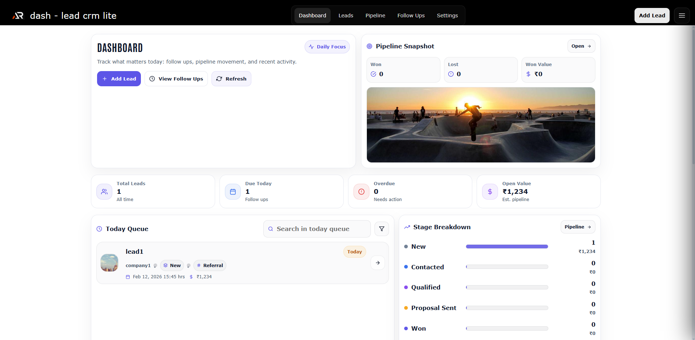

<div align="center">

# dash-lead-crm-lite

A frontend-only Lead CRM demo built in React to track leads, manage pipeline stages, and stay on top of follow-ups.

</div>

---



---

## What this is

dash-lead-crm-lite is a light-theme CRM UI that helps you:

- track leads and their status
- move leads through a sales pipeline
- plan and complete follow-ups
- view daily priorities on a dashboard

This is a frontend-only demo. Data is stored locally and can be exported/imported.

---

## Pages

- Dashboard - todays queue, overdue, upcoming, pipeline snapshot
- Leads - searchable list with filters, sort, bulk actions
- Lead Details - lead profile, timeline, notes, next follow-up
- Pipeline - stage board view for moving leads across stages
- Follow Ups - overdue and upcoming follow-ups in one place
- Settings - stages, sources, owners, export/import, reset demo data

---

## Key features

- Lead lifecycle stages: new, contacted, qualified, proposalSent, won, lost
- Timeline events: call, email, meeting, note, stage change
- Follow-up planning: schedule, reschedule, mark done, snooze
- Filters: stage, source, tags, owner, date range
- Export and import: JSON and CSV style exports
- Light theme only, no green usage in the UI

---

## Tech stack

- React (Vite)
- styled-components
- React Router

---

## Local development

1. Install dependencies

```bash
npm install
```

2. Start dev server

```bash
npm run dev
```

3. Build

```bash
npm run build
```

4. Preview build

```bash
npm run preview
```

## Links

- Portfolio: [https://www.ashishranjan.net](https://www.ashishranjan.net)
- GitHub: [https://github.com/a2rp](https://github.com/a2rp)
- CodePen: [https://codepen.io/ash1198](https://codepen.io/ash1198)
- LinkedIn: [https://www.linkedin.com/in/aashishranjan](https://www.linkedin.com/in/aashishranjan)
- Facebook: [https://www.facebook.com/theash.ashish/](https://www.facebook.com/theash.ashish/)
- YouTube: [https://www.youtube.com/@ashishranjan-ashz?sub_confirmation=1](https://www.youtube.com/@ashishranjan-ashz?sub_confirmation=1)
- Email: [ash.ranjan09@gmail.com](mailto:ash.ranjan09@gmail.com)

## Support

- Support: [https://a2rp-donation-page.netlify.app/](https://a2rp-donation-page.netlify.app/)
- Buy Me A Coffee: [https://buymeacoffee.com/a2rp](https://buymeacoffee.com/a2rp)
- Patreon: [https://patreon.com/a2rp](https://patreon.com/a2rp)
<!-- Project links -->

## Links

- Live: [https://a2rp.github.io/dash-lead-crm-lite/](https://a2rp.github.io/dash-lead-crm-lite/)
- Repository: [https://github.com/a2rp/dash-lead-crm-lite](https://github.com/a2rp/dash-lead-crm-lite)
- Portfolio: [https://www.ashishranjan.net/](https://www.ashishranjan.net/)
- GitHub: [https://github.com/a2rp](https://github.com/a2rp)
- CodePen: [https://codepen.io/ash1198](https://codepen.io/ash1198)
- LinkedIn: [https://www.linkedin.com/in/aashishranjan](https://www.linkedin.com/in/aashishranjan)
- Facebook: [https://www.facebook.com/theash.ashish/](https://www.facebook.com/theash.ashish/)
- YouTube: [https://www.youtube.com/@ashishranjan-ashz?sub_confirmation=1](https://www.youtube.com/@ashishranjan-ashz?sub_confirmation=1)
- Email: [ash.ranjan09@gmail.com](mailto:ash.ranjan09@gmail.com)

## Support

- Support: [https://a2rp-donation-page.netlify.app/](https://a2rp-donation-page.netlify.app/)
- Buy Me a Coffee: [https://buymeacoffee.com/a2rp](https://buymeacoffee.com/a2rp)
- Patreon: [https://www.patreon.com/a2rp](https://www.patreon.com/a2rp)
