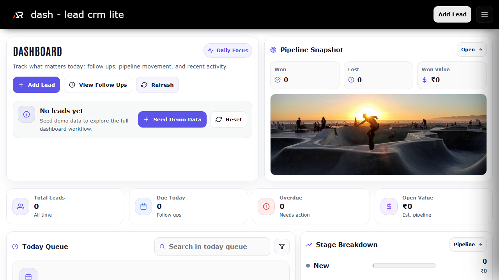

# Dash Lead CRM Lite

A frontend-only React CRM workspace for tracking leads, managing pipeline stages, and staying on top of follow-ups. Demo data and settings are stored locally in the browser.

## Features

- Dashboard with daily priorities and pipeline metrics
- Searchable leads with filters, sorting, details, and timeline events
- Pipeline stage board with follow-up planning
- Local export/import tools and configurable settings
- Responsive layout with keyboard-friendly navigation

## Tech stack

React, Vite, React Router, styled-components, Material UI, and React Icons.

## Run locally

Run npm install, then npm run dev. Use npm run build to create a production build and npm run preview to preview it.

## Links

- Portfolio: [https://www.ashishranjan.net](https://www.ashishranjan.net)
- GitHub: [https://github.com/a2rp](https://github.com/a2rp)
- CodePen: [https://codepen.io/ash1198](https://codepen.io/ash1198)
- LinkedIn: [https://www.linkedin.com/in/aashishranjan](https://www.linkedin.com/in/aashishranjan)
- Facebook: [https://www.facebook.com/theash.ashish/](https://www.facebook.com/theash.ashish/)
- YouTube: [https://www.youtube.com/@ashishranjan-ashz?sub_confirmation=1](https://www.youtube.com/@ashishranjan-ashz?sub_confirmation=1)
- Email: [ash.ranjan09@gmail.com](mailto:ash.ranjan09@gmail.com)

## Support

- Support: [https://a2rp-donation-page.netlify.app/](https://a2rp-donation-page.netlify.app/)
- Buy Me a Coffee: [https://buymeacoffee.com/a2rp](https://buymeacoffee.com/a2rp)
- Patreon: [https://patreon.com/a2rp](https://patreon.com/a2rp)
